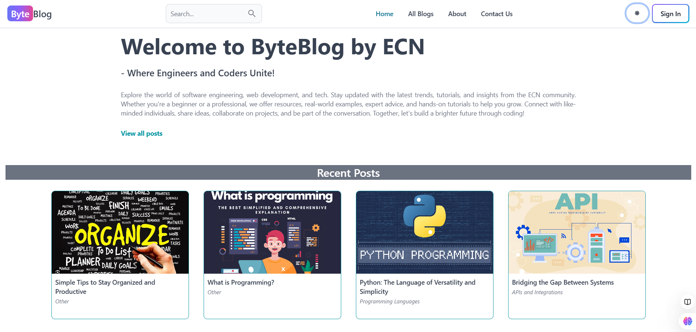
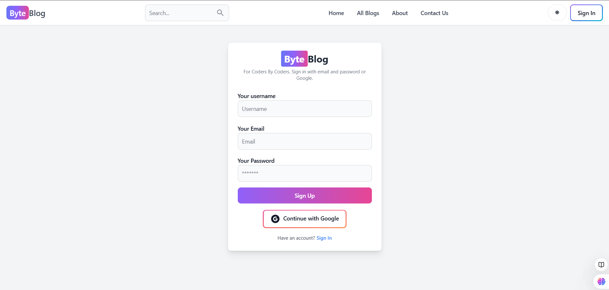
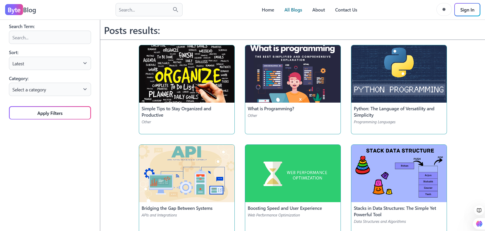
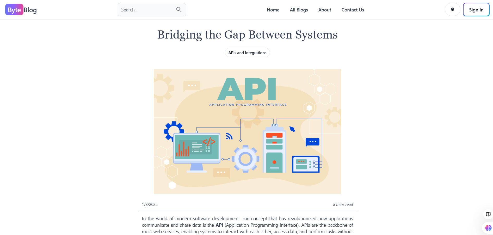
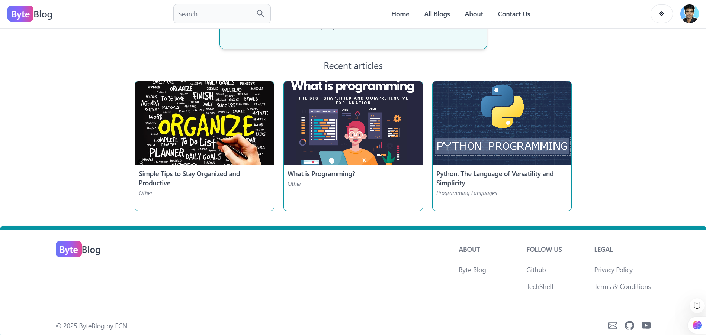
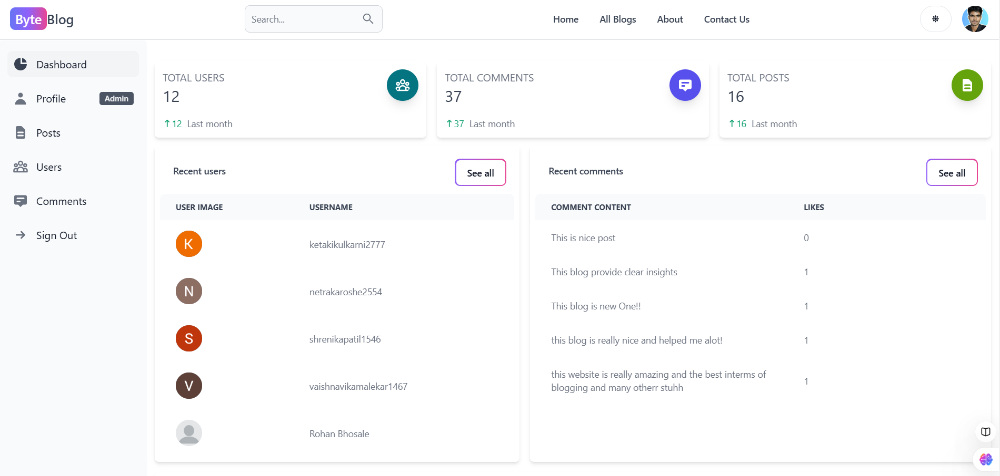
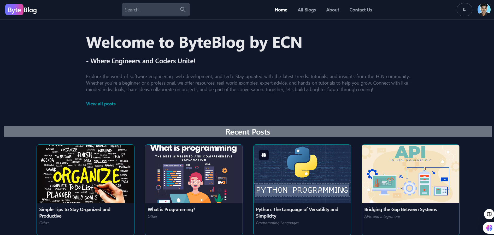
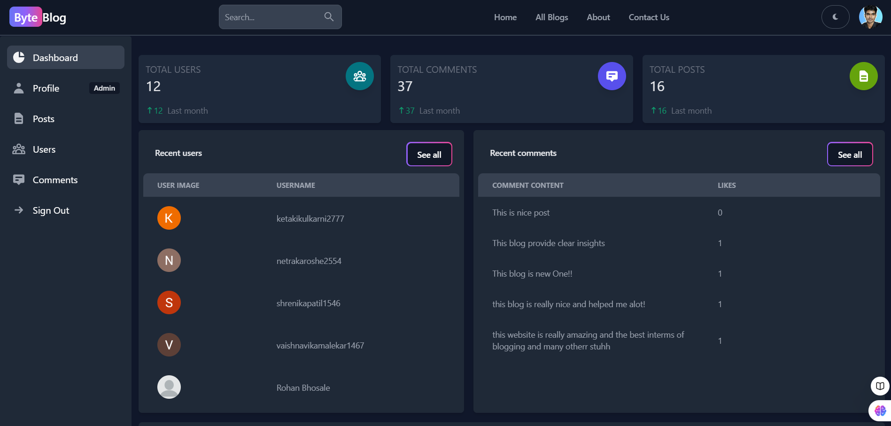

# 🌟 MERN Stack Blog Application
## 📝 Description 
This project is a Full Stack MERN Blog Application, designed to be fully responsive and feature-rich, with a focus on creating a robust blogging platform. The application is built using the latest technologies in web development, including MongoDB, Express.js, React.js, and Node.js. The app includes functionalities for creating, reading, updating, and deleting posts (CRUD), advanced authentication with JWT and Google OAuth, an admin dashboard, and much more.


## 🎯 Features
#### General Features
- 💻 Fully responsive design with **Dark Mode** support.
- 🌐 Dynamic pages built with **React Router Dom**.
- 🔒 Advanced authentication system with **JWT** and **Google OAuth**.
- 🛠️ State management using **Redux Toolkit** with persistence.

#### 👤User Features
- ✍️ View, create, edit, and delete blog posts.
- 💬 Comment on posts and manage comments (edit, delete).
- 👍 Like functionality for comments.
- 🔍 Advanced search functionality with title-based filtering, sorting, and limiting results.

#### 🛡️Admin Features
- 🔐 Secure admin dashboard with CRUD operations for managing posts, comments, and users.
- 📊 Overview page for admin to monitor activity.

#### 🖥️ Backend Features
- 🔄 API routes for user and post management.
- ⚙️ Error handling middleware.
- 🗂️ MongoDB integration with Mongoose.
- 📸 User image upload functionality.

## 💻 Technologies Used

- **Frontend**: React.js, Tailwind CSS, Redux Toolkit
- **Backend**: Node.js, Express.js
- **Database**: MongoDB
- **Authentication**: JWT, Google OAuth
- **Deployment**: Render


## Screenshots
















## ⚙️ Installation
#### Prerequisites

✅ Node.js installed on your system.

✅ MongoDB installed and running locally or accessible remotely.

#### Steps:

**1. Clone the repository**:

```bash
git clone https://github.com/AbhijeetKamalekar15/MERN-Blog.git
cd MERN-Blog
```

**2. Install dependencies for both the client and server**:
```bash
cd client
npm install
cd ..
npm install
```

**3. Set up environment variables**:

Create a .env file in the server directory with the following variables:
```bash
VITE_FIREBASE_API_KEY=
JWT_SECRET=
MONGO=
```

**4**. **Start the development servers**:

In the server directory
```bash
npm run dev
```

In the client directory
```bash
npm run dev
```

Open the application in your browser at http://localhost:5173. 🌟
    
## 🚀 Deployment
Application deployed for free on the Render platform.
[Visit Site](https://byteblog-sqb3.onrender.com/)

